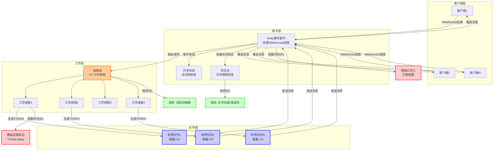

# 并发模型图

## 并发模型说明

### 1. 核心组件

1. **线程/事件循环**：使用Netty的NioEventLoopGroup，负责处理WebSocket连接、消息接收和发送。

2. **线程池**：固定大小的线程池（4个线程），用于处理业务逻辑，生成TOKEN消息。

3. **有界队列**：为每个会话维护一个有界队列（容量为10），用于存储待发送的TOKEN消息。

4. **共享状态**：会话映射表，用于跟踪所有活跃的会话。

5. **背压点**：当队列达到容量上限时，触发背压策略，拒绝新的TOKEN消息并关闭连接。

### 2. 阻塞风险点

1. **风险点1**：工作线程中的模拟处理延迟（Thread.sleep），可能导致处理速度跟不上消息生成速度。

2. **风险点2**：网络IO写入操作，当客户端接收速度慢时，可能导致EventLoop阻塞。

### 3. 观测点

1. **观测点1**：线程池的活跃线程数，用于监控系统负载。

2. **观测点2**：队列长度和错误率，用于监控背压策略的触发情况。

### 4. 背压策略

当客户端处理速度慢于消息生成速度时：
1. 消息会被加入到有界队列中
2. 当队列达到容量上限时，触发OVERLOADED错误
3. 关闭连接，防止系统资源耗尽

### 5. 数据流

1. 客户端发送START消息到网关
2. 网关路由请求到工作线程
3. 工作线程生成TOKEN消息并加入队列
4. 事件循环从队列中取出消息并发送给客户端
5. 当客户端处理慢时，队列填满，触发背压策略